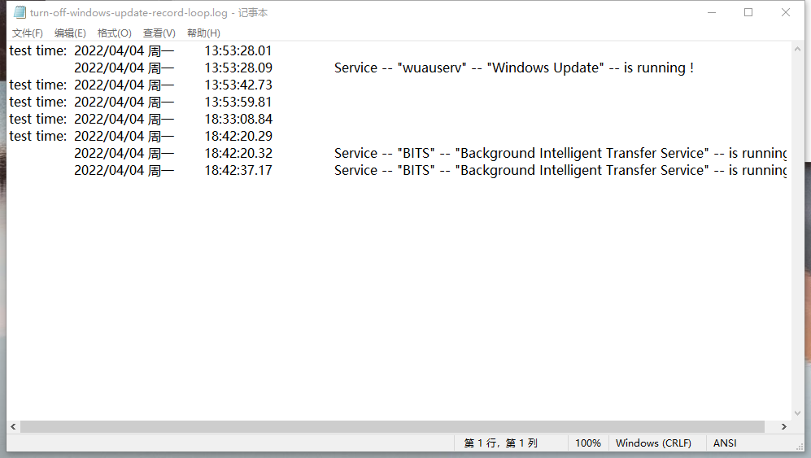
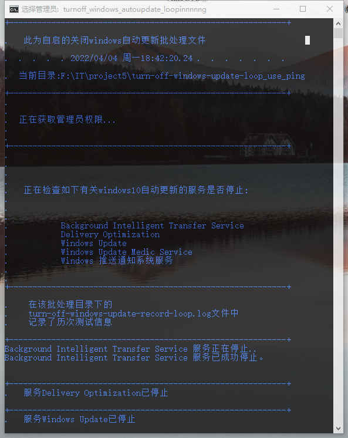

# 关闭windows自动更新

作者本地版本：Windows10专业版`21H2  19044.1586` 稳定运行。


## 图示

日志输出：



批处理输出：



## 坑

2023.3.30 当我使用docker时报错如下：

```
error during connect: In the default daemon configuration on Windows, the docker client must be run with elevated privileges to connect.: Post "http://%2F%2F.%2Fpipe%2Fdocker_engine/v1.24/images/create?fromImage=onlyoffice%2Fdocumentserver&tag=latest": open //./pipe/docker_engine: The system cannot find the file specified.
```

然后我打开Docker Desktop，报错如下：

```
Update the WSL kernel by running "wsl --update" or follow instructions at https://docs.microsoft.com/windows/wsl/wsl2-kernel.
```

然后我执行`wsl --update`发现更新不了。最后关闭了这个禁用更新的脚本才得以更新。。。

所以假如你们遇到docker如上报错，可能是因为你没有更新wsl。